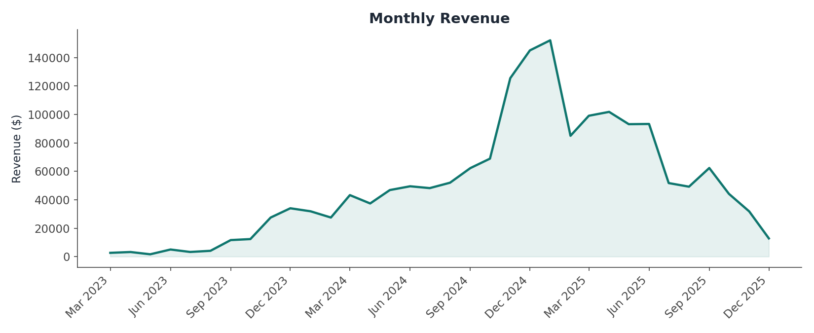
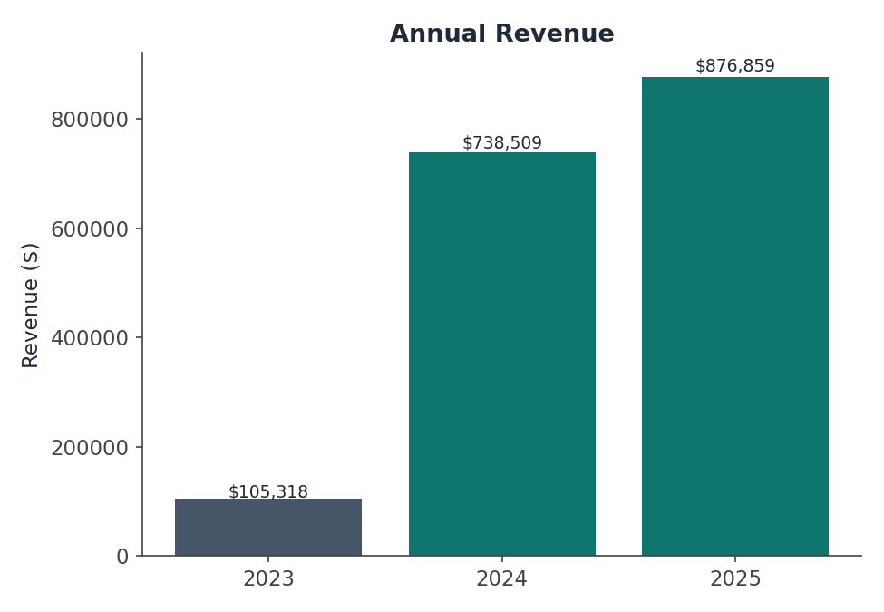
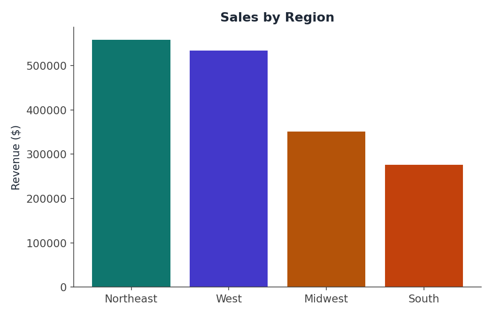
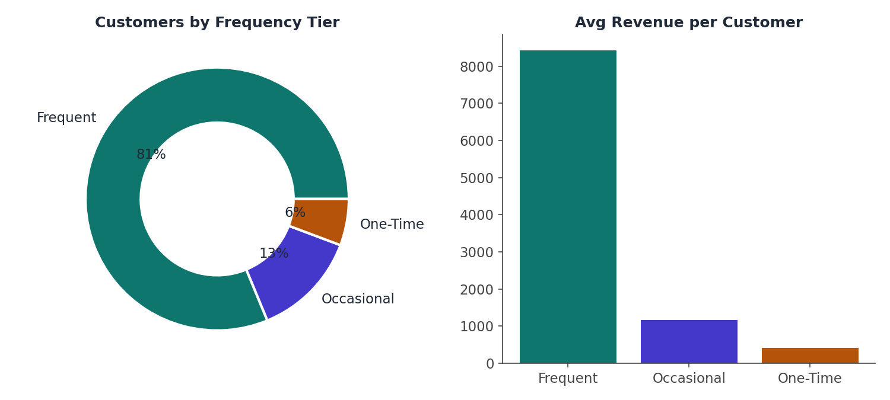
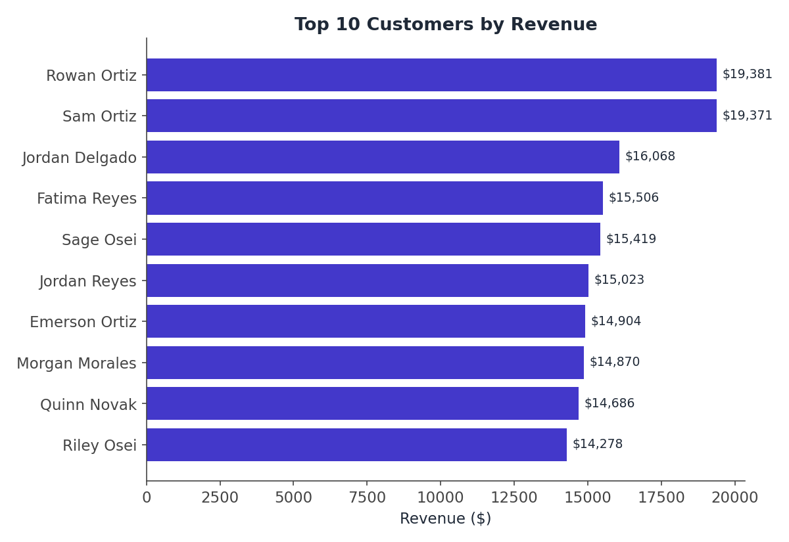
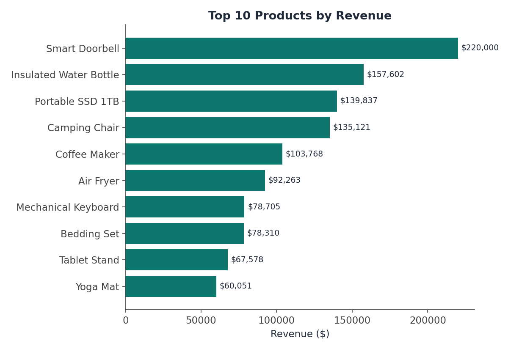

# SQL Business Insights Dashboard


Analyzing retail transaction data with SQL to generate the insights a
management team actually needs: monthly revenue, top customers,
product performance, regional sales, and year-over-year growth — each
one backed by a real, runnable query.

## Interactive Query Notebook

Open [`dashboard/index.html`](dashboard/index.html) in a browser. Every
insight is shown as a card with the **actual SQL query on the left**
and its **live result (chart or table) on the right** — click a card
to collapse/expand it. This is meant to make the SQL itself the
centerpiece, not hide it behind a polished chart.

## Skills Demonstrated

- ✔ SQL (JOIN, GROUP BY, HAVING, CASE, subqueries, CTEs)
- ✔ Window Functions (`LAG()`, `RANK()`, running totals)
- ✔ Relational Data Modeling (normalized schema, not a flat table)
- ✔ Business/KPI Reporting
- ✔ Data Analysis & Insight Writing

## Objective

Analyze business transaction data using SQL to generate meaningful
insights for management — revenue trends, top performers, and
underperformers — backed by clean, well-commented, portable SQL.

## Dataset

A normalized retail schema — not a single pre-flattened table — so
the analysis genuinely requires JOINs across tables, the way real
transactional databases are structured:

| Table | Rows | Description |
|---|---|---|
| `customers` | 260 | Customer ID, name, region, signup date, segment |
| `products` | 44 | Product ID, name, category, unit price, unit cost |
| `orders` | 3,833 | Order ID, customer, order date |
| `order_items` | 6,765 | Line items: order, product, quantity, price, discount |

Available as CSVs in `data/` and as a ready-to-query SQLite database
at `data/sales.db`.

## How to Run

```bash
# Explore with the SQLite CLI
sqlite3 data/sales.db < sql/queries.sql

# Or open data/sales.db in any SQL client (DB Browser for SQLite, etc.)
# Or open the interactive notebook — no SQL client needed:
open dashboard/index.html
```

## SQL Analysis Included

| # | Analysis | Concepts |
|---|---|---|
| 1 | Monthly Revenue | JOIN, GROUP BY, aggregate functions |
| 2 | Total Orders & Average Order Value | Aggregate functions |
| 3 | Top 10 Customers by Revenue | JOIN ×3, GROUP BY, HAVING |
| 4 | Product Performance (tiered) | JOIN, GROUP BY, CASE |
| 5 | Slow-Moving Inventory | JOIN, GROUP BY, HAVING |
| 6 | Sales by Region | JOIN ×3, GROUP BY, HAVING |
| 7 | Customer Purchase Frequency | CASE, subquery, GROUP BY |
| 8 | Year-over-Year Growth | Window function: `LAG()`, CTE |
| 9 | Running Total of Monthly Revenue | Window function: `SUM() OVER` |
| 10 | Top Product per Category | Window function: `RANK() OVER (PARTITION BY ...)` |
| 11 | New vs. Returning Customer Revenue | CASE, aggregate |
| 12 | Discount Impact by Category | Aggregate functions |

Full SQL with comments explaining each concept:
[`sql/queries.sql`](sql/queries.sql)

## Results Preview

**Monthly revenue**


**Annual revenue (YoY growth)**


**Sales by region** &nbsp;&nbsp; **Customer frequency segmentation**



**Top 10 customers**


**Top 10 products**


## Key Business Insights

- **77% of customers are "Frequent" buyers (5+ orders) and generate
  ~20x the revenue of one-time customers** — retention of this
  segment is the single highest-leverage lever in the business.
- **The South region generates roughly half the revenue of the
  Northeast** despite a comparable customer base — a clear
  underperformance signal worth investigating.
- **7 of 44 products are Slow-Moving** (<$6,000 lifetime revenue),
  concentrated in Apparel and Beauty & Personal Care.
- **Confirmed Nov/Dec seasonality** every year, with Jul/Aug troughs —
  reliable enough to plan inventory and staffing around.
- **2024→2025 revenue grew 18.7%** (the fair year-over-year
  comparison, since 2023 is a partial year) — healthy, sustainable
  growth rather than one-time volatility.

Full write-up: [`report/business_insights_report.md`](report/business_insights_report.md)

## Business Recommendations

- ✔ Increase inventory and marketing spend for top-selling products (Smart Doorbell, Insulated Water Bottle, Portable SSD 1TB)
- ✔ Investigate why the South region underperforms — coverage, pricing, or awareness gap
- ✔ Build a retention program for Frequent-tier customers; they're 77% of customers but drive the majority of revenue
- ✔ Reduce or reposition the 7 slow-moving products via clearance pricing or bundling
- ✔ Plan inventory and staffing around the confirmed Nov/Dec seasonal spike

## Project Structure

```
sql-business-insights-dashboard/
├── data/
│   ├── customers.csv
│   ├── products.csv
│   ├── orders.csv
│   ├── order_items.csv
│   └── sales.db                   # SQLite database (ready to query)
├── sql/
│   └── queries.sql                # 12 documented queries
├── dashboard/
│   ├── index.html                 # interactive "query notebook" dashboard
│   └── data.js                    # pre-aggregated query results
├── report/
│   └── business_insights_report.md
├── screenshots/
│   ├── banner.png
│   ├── monthly_revenue.png
│   ├── annual_revenue.png
│   ├── sales_by_region.png
│   ├── customer_frequency.png
│   ├── top_customers.png
│   └── top_products.png
├── generate_data.py                # builds the dataset
├── make_charts.py                  # builds the static preview charts
├── make_banner.py                  # builds the banner image
└── README.md
```

## GitHub Topics

`sql` `sqlite` `business-intelligence` `data-analysis` `window-functions`
`retail-analytics` `kpi` `data-visualization` `portfolio`

## Next Steps / Ideas for Extending This

- Port the schema to MySQL/PostgreSQL and note any syntax differences
- Add a cohort retention analysis using window functions
- Add a customer lifetime value (CLV) calculation
- Connect the dashboard to a live database via a small API instead of a static data bundle

---

*This dataset is synthetically generated for portfolio/practice
purposes, with realistic seasonality, regional variance, and customer
loyalty patterns built in — no real transaction data is included.*
