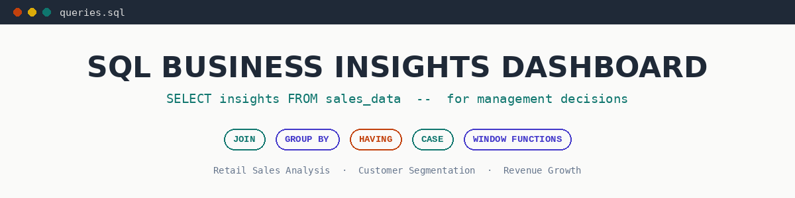

# SQL Business Insights Dashboard




## Project Overview

This project demonstrates how SQL can be used to analyze business data and generate actionable insights for decision-making. Using a synthetic sales dataset, the project explores revenue trends, customer purchasing behavior, regional sales performance, and key business metrics through SQL queries and interactive visualizations.

The objective is to showcase practical SQL skills for business analytics by transforming raw transactional data into meaningful reports that support data-driven business decisions.

---

## Skills Demonstrated

- SQL Query Writing
- Business Data Analysis
- Sales Performance Analysis
- Customer Segmentation
- Revenue Trend Analysis
- KPI Reporting
- Business Intelligence
- Dashboard Development
- Data Visualization
- Decision Support Analytics

## Project Highlights

- Analyzed business sales data using SQL to generate actionable business insights.
- Evaluated monthly revenue trends to identify business growth patterns.
- Performed regional sales analysis to compare market performance.
- Identified top-performing customers based on purchase value and frequency.
- Developed SQL queries to calculate key business performance indicators (KPIs).
- Created interactive dashboards and visualizations for business reporting.
- Demonstrated practical SQL skills for business analytics and decision support.

---

## Business Value

This project demonstrates how SQL can support business decision-making by transforming raw sales data into meaningful insights that improve strategic planning and operational performance.

Key business benefits include:

- Monitoring monthly revenue trends to evaluate business growth.
- Identifying high-performing regions for better resource allocation.
- Understanding customer purchasing behavior to improve retention.
- Recognizing top customers to support targeted marketing strategies.
- Measuring key business performance indicators (KPIs) for executive reporting.
- Enabling data-driven decision-making through SQL-based analytics and dashboards.

## Dataset

This project uses a **synthetic sales dataset** designed to simulate real-world business transactions for SQL-based business analysis and reporting.

### Dataset Summary

| Attribute | Value |
|-----------|-------|
| Dataset Type | Synthetic Sales Data |
| File Format | CSV & SQL Database |
| Purpose | Business Analytics & KPI Reporting |
| Domain | Retail Sales |

### Example Data Fields

| Column | Description |
|---------|-------------|
| Order ID | Unique sales transaction ID |
| Order Date | Date of the transaction |
| Customer | Customer name or identifier |
| Product | Product sold |
| Category | Product category |
| Region | Sales region |
| Quantity | Units sold |
| Sales | Revenue generated |
| Profit | Profit earned |

> **Note:** This dataset is synthetic and created for educational and portfolio purposes. No real business data is included.

## Technologies Used

| Technology | Purpose |
|------------|---------|
| SQL | Data extraction, aggregation, and business analysis |
| Python | Generate sample datasets and visualizations |
| HTML/CSS | Dashboard layout and presentation |
| JavaScript | Interactive dashboard functionality |
| Data Visualization | Business reporting and KPI presentation |
| Git & GitHub | Version control and portfolio management |

---

## 📂 Project Structure

```
sql-business-insights-dashboard/
│
├── dashboard/
├── data/
├── report/
├── screenshots/
├── sql/
├── generate_data.py
├── make_banner.py
├── make_charts.py
└── README.md
```

---

## 📸 Dashboard Preview

Dashboard screenshots are available inside the **screenshots/** folder.

---

## Key Findings

- Analyzed business sales data to identify revenue trends across different time periods.
- Identified the highest-performing sales regions based on total revenue.
- Ranked top customers by purchase value and transaction frequency.
- Evaluated monthly sales performance to identify seasonal business trends.
- Calculated key business performance indicators (KPIs) using SQL queries.
- Generated data-driven reports to support strategic business decision-making.
- Built dashboard-ready SQL outputs for executive reporting and business intelligence.

---

## Recommendations

Based on the SQL analysis, the following business recommendations are proposed:

- Monitor monthly revenue trends to support strategic planning.
- Focus marketing efforts on high-performing customer segments.
- Allocate resources toward regions with the highest revenue potential.
- Improve customer retention through loyalty and repeat-purchase strategies.
- Track key business KPIs regularly using SQL dashboards.
- Automate business reporting to enable faster decision-making.
- Expand data collection to improve forecasting and business intelligence.

## Future Enhancements

Potential improvements for future versions of this project include:

- Develop an interactive Power BI dashboard for real-time business reporting.
- Integrate the project with live sales databases for automated analytics.
- Add sales forecasting using machine learning techniques.
- Expand customer segmentation with RFM (Recency, Frequency, Monetary) analysis.
- Build executive-level KPI dashboards for management reporting.
- Automate SQL report generation using scheduled workflows.
- Enhance visualizations with additional business performance metrics.

## How to Run

### Option 1: Using SQLite (Recommended)

```bash
sqlite3 data/business_insights.db < sql/queries.sql
```

### Option 2: Using DB Browser for SQLite

1. Open the database file from the `data` folder.
2. Open `sql/queries.sql`.
3. Execute the SQL queries one by one.
4. Review the generated business insights and reports.

### Option 3: Using MySQL or PostgreSQL

1. Import the sales dataset into your database.
2. Create the required tables.
3. Execute the SQL queries from the `sql` folder.
4. Analyze the generated reports and dashboard results.

---

---

## Author

**Animesh Thube**

GitHub:
https://github.com/animeshthube

---

⭐ If you found this project useful, consider giving it a star.

---
*This project uses synthetic business data created for educational and portfolio purposes. No real company data is included.*
